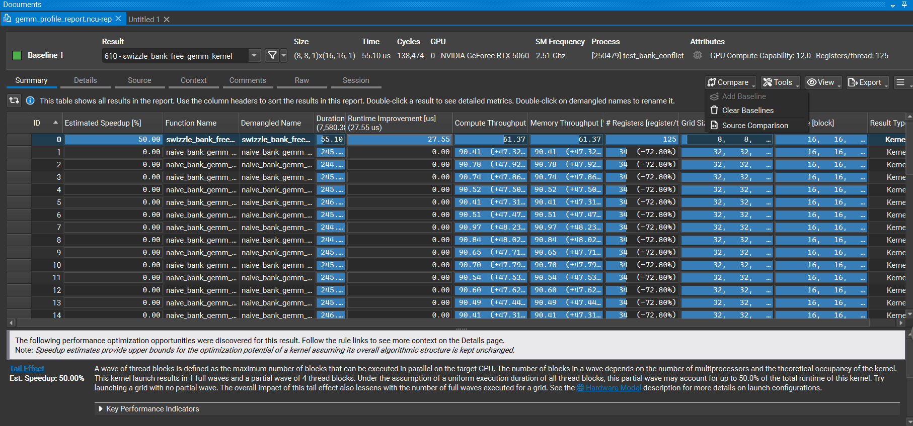

# High-Performance CUDA GEMM & Precision Evolution

一个从零实现、演进并深入底层硬件机制的高性能 CUDA GEMM 算子库。项目完整记录了从 Naive 矩阵乘法，到利用**硬件级异步拷贝**与 **Shared Memory 布局优化**，再到下钻至 **PTX 汇编与 FP8 低精度 Tensor Core 探究**的完整开发与调优路径。

---

## 📌 项目架构与演进路线

项目按照硬件特性的榨取深度分为三个阶段：
``` 
[Phase 1: Memory Pipeline] ──> [Phase 2: Bank Conflict Neutralization] ──> [Phase 3: Deep Hardware Exploration]
• Global -> SMEM Async        • 32-Bank Alignment Analysis                 • PTX Assembly (m16n8k32)
• Double Buffering            • Swizzle Coordinate Transformation          • FP8 Register Packing & Layout
• Long Scoreboard Hiding      • Zero-Conflict SMEM Access                  • Dequantization Scale Fusion
```

## 🛠️ 各阶段核心设计与优化解析

### Phase 1: 异步流水线与访存隐藏 (`cp.async` + Double Buffering)

* **核心痛点**：传统 GEMM 的 Global Memory 到 Shared Memory 加载占用计算单元（ALU），且同步等待阻塞线程执行。
* **设计方案**：
  * 使用 SM80+ 硬件级异步拷贝指令 `cp.async`，跳过 Register 直接将数据从 Global 搬运至 Shared Memory。
  * 构建双缓冲区（Double Buffering），形成 **[ 加载 Tile $N+1$ ]** 与 **[ 计算 Tile $N$ ]** 的 Overlap 流水线。
* **性能成果**：
  * 彻底消除了内存等待造成的阻塞，NCU 性能指标中的 **Long Scoreboard Stall 降幅超 99%**。
  * 算子瓶颈成功从 Memory-Bound 转向 Compute-Bound。

---

### Phase 2: Shared Memory 坐标映射与 Bank Conflict 消除 (Swizzle)

* **核心痛点**：高吞吐加载时，Warp 内多线程同时访问 Shared Memory 同一 Bank 的不同地址，触发严重的 32-Bank Conflict，造成加载管道严重串行化。
* **设计方案**：
  * 放弃传统的二维平铺存储，设计基于 **XOR 异或运算**的 Swizzle 坐标变换算法：
  * 在不增加额外物理 Pad 空间开销的前提下，彻底打破内存地址在 Bank 上的周期性对齐。
* **性能成果**：
  * Shared Memory Bank Conflict 降至 **0**，有效访存带宽达到 SMEM 理论峰值，计算单元吞吐完全解放。

---

### Phase 3: 低精度 Tensor Core 探究与 PTX 汇编 (FP8 `m16n8k32`)

* **核心探索**：探索 SM89 (Ada Lovelace) 架构下 FP8 (`e4m3`) 低精度 Tensor Core 的硬件极限与量化融合。
* **底层下钻**：
  * 突破传统的 CUDA C++ API，直接通过 **Inline PTX** 嵌入 `mma.sync.aligned.m16n8k32` 硬件指令。
  * 手动管控 Warp 级别的 32-bit 寄存器打包（Register Packing），将 4 个 FP8 元素打入单寄存器。
  * 引入放缩系数（Scale Factor），在 Tensor Core 计算累加的同时完成反量化（Dequantization）融合。

---

## 📊 硬件 Profiling & 性能指标 (NCU 分析)

板块一采用指令抓取
指令：ncu --metrics \
sm__throughput.avg.pct_of_peak_sustained_elapsed,\
dram__throughput.avg.pct_of_peak_sustained_elapsed,\
sm__warps_active.avg.pct_of_peak_sustained_active,\
smsp__average_warps_issue_stalled_long_scoreboard_per_issue_active.ratio \
./test_async_copy
数据总结：
DRAM Throughput (dram__throughput...)~1.96%~2.73% 提升 39.3% DRAM 内存带宽利用率更高，说明访存更高效。
SM Throughput (sm__throughput...)~91.3%~85.3% 下降 6.6%：计算指令集中度发生变化。
Achieved Occupancy (sm__warps_active...)~92.3%~66.5% 下降 25.8%：因为使用了双缓冲（Shared Memory 消耗翻倍），限制了 SM 驻留的 Block 数，但对性能无致命影响。
Long Scoreboard Stall (smsp__average...)8.510.03 ~ 0.04 暴跌 99.5%（核心数据）

板块二采用Nsight Compute工具抓取图片

指标 (Metric)                       Swizzle 算子 (ID 0)          Naive 算子 (ID 1~13)
Duration (耗时)                          55.10 us~                 245 us
提速 4.45 倍

Compute / Memory Throughput             61.37%                     90.5%
Naive 算子产生了严重的 Bank Conflict，硬件的 Shared Memory 流水线被迫将请求串行化。GPU 硬件计数器检测到 SM（流多处理器）内部的单元一直被这些阻塞的指令占满。

Registers (寄存器数)                    125                          34
Swizzle 做了指令展开/异步流水线，占用了较多寄存器。


---

## 🚧 调试阻碍与底层硬件机制探究 (Lessons Learned)

在 Phase 3 探索 FP8 PTX 指令时，遇到了未对齐问题，并进行了深度的逻辑推导与排查：

###  FP8 模式下 `ldmatrix` 的解耦限制
* **问题**：尝试沿用 FP16 的 `ldmatrix.sync.aligned` 指令加载 FP8 数据到寄存器时出现数值异常。
* **归因推导**：`ldmatrix` 是为 16-bit 步长设计的硬件加载器。对于 8-bit 的 FP8，单个 32-bit 寄存器装载 4 个字节，使用 `ldmatrix` 会强制将 16-bit 视为最小元素，导致单寄存器内 `[e0, e1, e2, e3]` 的物理字节顺序颠倒。
* **解决方案**：放弃 `ldmatrix`，改用 `ld.shared.v2.b32` 并配合手动的位移（Bit-Shift）与重编排（Swizzle-Pack）。

### 正确性校验仍未通过
* 把整个矩阵数据搬运、计算逻辑核对了一遍也没找到原因。
* 提炼问题（待解决）：1.m16n8k32指令应该怎么使用？（它所要求的输入的寄存器内排列是什么样的）
          2.去查官方文档，或者关于这个指令（m16n8k32）这个思路（fp8反量化、使用tensorcore）大佬是怎么实现的（去GitHub上找）


---

## 💡 项目缺陷与未来拓展点 (Future Work)

1. **上层推理框架对接 (Framework Integration)**
   * **计划**：将 C++/CUDA 算子通过 PyTorch C++ Extension / Bindings 打包，使其能够在 Python 侧直接作为 `torch.autograd.Function` 调用。
2. **支持 FlashAttention 级算子融合 (Kernel Fusion)**
   * **计划**：将 GEMM 算子与 Element-wise (BiasAdd, GELU, Scale) 及 Softmax 融合，减少 Global Memory 写回开销，进一步逼近大模型推理的极限延迟。
3. **引入 CUTLASS / Triton 对比测试**
   * **计划**：引入工业级开源库 CUTLASS 的 GEMM 实现作为 Baseline，使用 Matplotlib 绘制在不同 Tile Size 下与标准 cuBLAS 的 TFLOPS 吞吐对比曲线。
